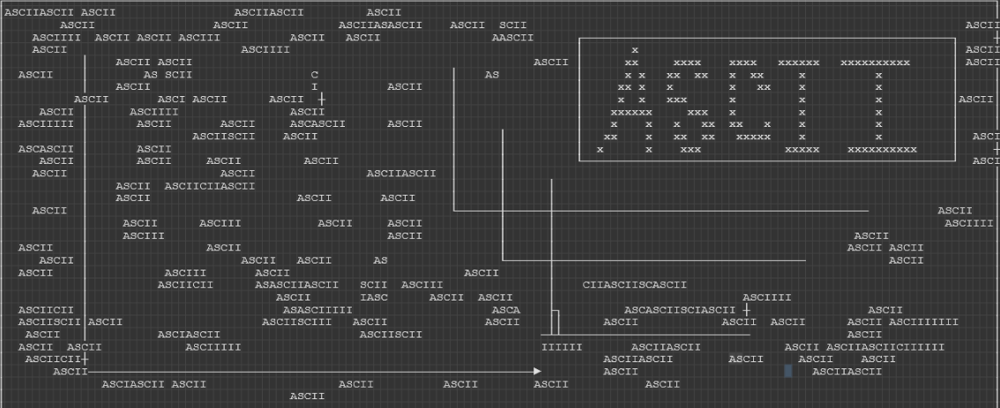
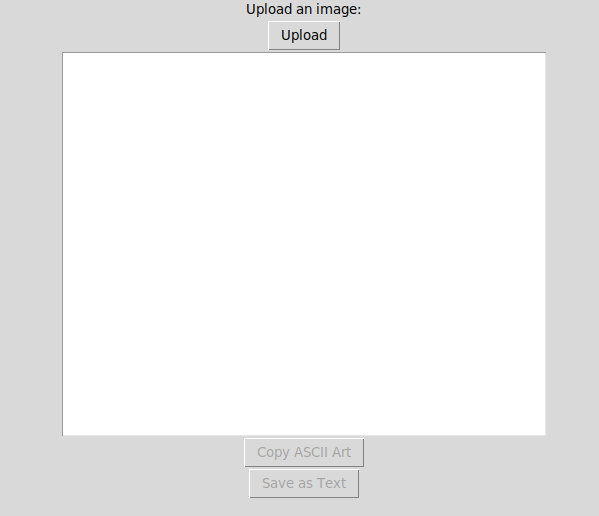
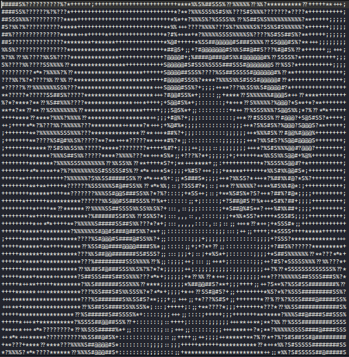

# ASCII Art Generator

This is a simple Python tool that converts images into ASCII art. It uses the PIL library to process images and generate ASCII representations based on pixel brightness levels.

## Features

- Upload and convert images to ASCII art.
- Copy ASCII art to the clipboard.
- Save ASCII art as a text file.

## Requirements

- Python 3.x
- Pillow library: `pip install pillow`
- Tkinter library (included in most Python installations)

## Usage

1. Clone the repository or download the source code.
2. Install the required libraries by running `pip install pillow` in your terminal.
3. Run the `ascii_art_generator.py` script.
4. Click the "Upload" button to select an image file.
5. The image will be converted to ASCII art and displayed in the text area.
6. Use the "Copy ASCII Art" button to copy the ASCII art to the clipboard.
7. Use the "Save as Text" button to save the ASCII art as a text file.

## Screenshots

## License

This project is licensed under the MIT License. See the [LICENSE](LICENSE.txt) file for more details.

## Acknowledgements

This tool is based on the concept of ASCII art and was inspired by various online resources and tutorials.
